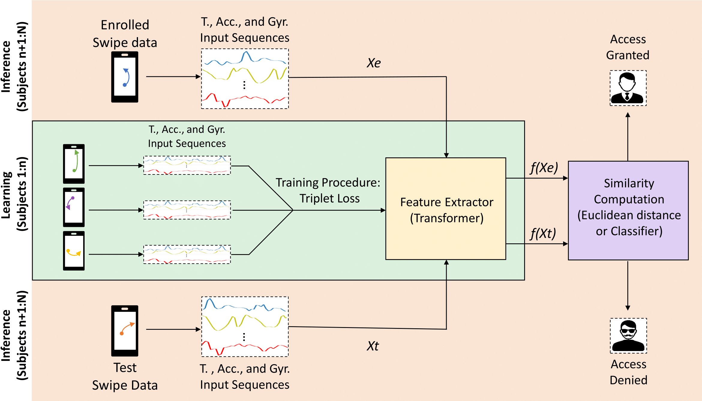

# SwipeFormer: Transformers for Mobile Touchscreen Biometrics



<!---# Welcome! 

In this page we provide all the necessary information to replicate the experimental protocol of SwipeFormer, a novel mobile touchscreen verification system based on
Transformers. --->


# Overview

This article explores and proposes novel touchscreen verification systems based on Transformers.

Transformers are more recently proposed DL architectures that have already garnered impmense interest due to their effectiveness across a range of application domains such as language assessment, vision, reinforcement learning, and biometrics [\[1\]]. Their main advantages compared with traditional CNN and RNN architectures are: *i)* Transformers are feed-forward models that process all the sequences in parallel, therefore increasing efficiency; *ii)* They apply Self-Attention/Auto-Correlation mechanisms that allows them to operate in long sequences; *iii)* They can be trained efficiently in a single batch since all the sequence is included in every batch; and *iv)* They can attend to the whole sequence, instead of summarising all the previous temporal information.

To our knowledge, this study represents the initial exploration of the potential application of Transformers in the domain of mobile touchscreen biometrics. Furthermore, it stands as the primary investigation to analyze unconstrained touchscreen gestures, yielding promising outcomes.


# Benchmark Evaluation of SwipeFormer

We analyse the performance of SwipeFormer using the popular publicly available databases collected under constrained conditions: *i)* Frank DB [\[2\]] and *ii)* HuMIdb [\[3\]]. SwipeFormer achieves EER values of 11.0\% and 5.0\% on Frank DB and HuMIdb, respectively, outperforming previous state-of-the-art approaches.


# Dependences 

`conda=22.9.0`

`CUDA`

`numpy=1.24.1`

`python=3.9.7`

`torch=1.11.0`


# Code

We will provide the evaluation scripts together with their pre-trained models shortly. 
<!--We provide the evaluation scripts together with their pre-trained models in this repo. -->


<!---over an evaluation set of *U* = 1000 subjects unseen in the training and validation phases. The metric chosen for evaluation is the Equal Error Rate (EER). 

We consider a fixed number of 15 acquisition sessions per subject. Out of these, we use a variable number of enrolment sessions (*E* = 1, 2, 5, 7, 10) in order to assess the performance adaptation of the system to reduced availability of enrolment data. Additionally, also the experiments are repeated changing the input sequence length, *L* = 30, 50, 70, 100, to evaluate the optimal keystroke sequence length.

The table below reports the results obtained by TypeFormer in comparison with two recently proposed keystroke verification studies. In [\[3\]](https://arxiv.org/abs/2212.13075), a different Transformer-based architecture was proposed as a preliminary version of the current work. In [\[4\]](https://ieeexplore.ieee.org/document/9539873), TypeNet, a Long Short Term Memory Recurrent Neural Network, was proposed.

The results contained in the table are expressed in terms of EER (%), and obtained according to the same experimental protocol, data subjects, and data acquisition sessions (corresponding to Table 2 in [\[1\]](https://arxiv.org/abs/2212.13075)). 

| Sequence Lenght *L* | Model | *E* = 1 | *E* = 2 | *E* = 5 | *E* = 7 | *E* = 10 |
| ---| --- | --- | --- | --- | --- | --- |
| 30 | TypeNet [\[4\]](https://ieeexplore.ieee.org/document/9539873) | 14.20 | 12.50 | 11.30 | 10.90 | 10.50 |
| 30 | **TypeFormer** [\[1\]](https://arxiv.org/abs/2212.13075) | **9.48** | **7.48** | **5.78** | **5.40** | **4.94** |
| 50 | TypeNet [\[4\]](https://ieeexplore.ieee.org/document/9539873) | 12.60 | 10.70 | 9.20 | 8.50 | 8.00 |
| 50 | Preliminary Transformer [\[3\]](https://arxiv.org/abs/2212.13075) | 6.99 | - | 3.84 | - | 3.15 |
| 50 | **TypeFormer** [\[1\]](https://arxiv.org/abs/2212.13075) | **6.17** | **4.57** | **3.25** | **2.86** | **2.54** |
| 70 | TypeNet [\[4\]](https://ieeexplore.ieee.org/document/9539873) | 11.30 | 9.50 | 7.80 | 7.20 | 6.80 |
| 70 | **TypeFormer** [\[1\]](https://arxiv.org/abs/2212.13075) | **6.44** | **5.08** | **3.72** | **3.30** | **2.96** |
| 100 | TypeNet [\[4\]](https://ieeexplore.ieee.org/document/9539873) | 10.70 | 8.90 | 7.30 | 6.60 | 6.30 |
| 100 | **TypeFormer** [\[1\]](https://arxiv.org/abs/2212.13075) | **8.00** | **6.29** | **4.79** | **4.40** | **3.90** |


# Experimental Protocol
The genuine and impostor score distributions are subject-specific. 

For each subject, genuine scores are obtained comparing the number enrolment sessions (*E*) with 5 verification sessions. The Euclidean distances are computed for each of the verification sessions with each of the *E* enrolment sessions, and then values are averaged over the enrolment sessions. Therefore, for each subject there are 5 genuine scores, one for each verification session. 

Concerning the impostor score distribution, for every other subject in the evaluation set, the averaged Euclidean distance value is obtained considering 1 verification session and the above-mentioned 5 enrolment sessions. Consequently, for each subject, there are 999 impostor scores. Based on such distributions, the EER score is calculated per subject, and all EER values are averaged across the entire evaluation set. 

# Data Subjects and Data Acquisition Sessions Used for Evaluation

For each subject, the enrolment sessions are the chosen in a orderly fashion from the first 10 sessions. For *E* = 1, the enrolment session chosen will be the first one. For *E* = 2, the enrolment sessions will be the first two, and so on. The verification sessions selected are always the last 5 sessions out of the 15 sessions per subject considered. 

All data sessions used for evaluation, separated by subject, are reported in the "TypeFormer_benchmark_sessions.json" file uploaded. Each key corresponds to a user identified by their "PARTICIPANT_ID" in the raw data of the Aalto Mobile Keystroke Database. For each user keys, each of the list elements correspond to the "TEST_SECTION_ID" of each of the acquisition sessions in the raw data.--->


# References

[\[1\] *Paula Delgado-Santos, Ruben Tolosana, Richard Guest, Ruben Vera-Rodriguez, and Farzin Deravi, “Exploring Transformers for Behavioural Biometrics: A Case Study in Gait Recognition”, Pattern Recognition, 2023.*](https://www.sciencedirect.com/science/article/pii/S003132032300496X)

[\[2\] *M. Frank, R. Biedert, E. Ma, I. Martinovic, D. Song, Touchalytics: On the Applicability of Touchscreen Input as a Behavioral Biometric for Continuous Authentication, IEEE Transactions on Information Forensics and Security 8 (2012) 136–138*](https://ieeexplore.ieee.org/document/6331527?denied=)

[\[3\] *A. Acien, A. Morales, J. Fierrez, R. Vera-Rodriguez and O. Delgado-Mohatar, BeCAPTCHA: Behavioral Bot Detection using Touchscreen and Mobile Sensors Benchmarked on HuMIdb, Engineering Applications of Artificial Intelligence 98 (2021) 104058*](https://www.sciencedirect.com/science/article/pii/S0952197620303274)

<!---#[\[4\] *B. Li, W. Cui, W. Wang, L. Zhang, Z. Chen, M. Wu, Two-stream Convolution Augmented Transformer for Human Activity Recognition, in: Proc. AAAI Conference on Artificial Intelligence, 2021*](https://ojs.aaai.org/index.php/AAAI/article/view/16103)

[\[5\] *H. Wu, J. Xu, J. Wang, M. Long, Autoformer: Decomposition Transformers with Auto-Correlation for Long-Term
Series Forecasting, in: Proc. Advances in Neural Information Processing Systems, 2021.*](https://proceedings.neurips.cc/paper_files/paper/2021/file/bcc0d400288793e8bdcd7c19a8ac0c2b-Paper.pdf)

[\[6\] *D. Hutchins, I. Schlag, Y. Wu, E. Dyer, B. Neyshabur, Block-Recurrent Transformers, in: Proc. Advances in Neural Information Processing Systems, 2022*](https://proceedings.neurips.cc/paper_files/paper/2022/file/d6e0bbb9fc3f4c10950052ec2359355c-Paper-Conference.pdf)

[\[7\] *A. Vaswani, N. Shazeer, N. Parmar, J. Uszkoreit, L. Jones, A. N. Gomez, L. Kaiser, I. Polosukhin, Attention is All
you Need, in: Proc. Advances in Neural Information Processing Systems, Vol. 30, 2017*](https://proceedings.neurips.cc/paper_files/paper/2017/file/3f5ee243547dee91fbd053c1c4a845aa-Paper.pdf)--->

# Citation

If you use our code please cite:

```
@article{delgado2024swipeformer,
  title={{Exploring Transformers for Behavioural Biometrics: A Case Study in Gait Recognition}},
  author={Delgado-Santos, Paula and Tolosana, Ruben and Guest, Richard and Lamb, Parker and Khmelnitsky, Andrei and Coughlan, Colm, and Fierrez, Julian},
  journal={Expert Systems with Applications},
  volume = {237},
  pages = {121537},
  year = {2024}
}

```

# Contact

If you have any questions, please contact us at [paula.delgadodesantos@telefonica.com](mailto:paula.delgadodesantos@telefonica.com) or [ruben.tolosana@uam.es](mailto:ruben.tolosana@uam.es).

<!---#**Contact: [paula.delgadodesantos@kent.ac.uk](mailto:paula.delgado-de-santos@kent.ac.uk)**--->
